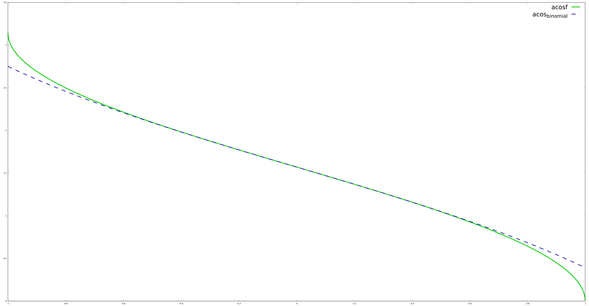

# Fast Approximation of `acosf`

In the course of looking for optimizations to a data processing pipeline
I had constructed for my research, I found that my implementation of Potamianos',
Maragos', and Quatieri's Discrete Energy Separation Algorithm (DESA)[1] proved a
significant bottleneck, occupying between 30-40% of total processing time.
Within the DESA stage, the standard `acosf` function provided by `<math.h>`
accounted for a seemingly inordinate percentage of total CPU time (around 15%).

DESA presents barriers to parallelization in that the calculations are causal,
with each element depending on prior values in the sequence. The data frames
used by the pipeline contained planar bands of data, which in theory could be
converted to an interleaved format for vectorization or parallelization.
However, I wanted to make sure that the tight inner loop of calculation was
as performant as possible before restructuring the data and forcing a cascade
of that restructuring to the rest of the pipeline.

With this in mind, I embarked on a search for a fast approximation of `acosf`
suitable for usage in the pipeline.

## Binomial Series Approximation

The $arccos$ function can be recast through an identity to $arcsin$ plus a constant.
The $arcsin$ function in turn can be approximated as a binomial series:[2]

$$
\begin{align}
	\textrm{arccos}(x) &= \frac{\pi}{2} - \textrm{arcsin}(x) \\
	\textrm{arcsin}(x) &= x
	           + \bigg(\frac{1}{2}\bigg)\bigg(\frac{x^3}{3}\bigg)
	           + \bigg(\frac{1 \cdot 3}{2 \cdot 4}\bigg)\bigg(\frac{x^5}{5}\bigg)
			   + \bigg(\frac{1 \cdot 3 \cdot 5}{2 \cdot 4 \cdot 6}\bigg)\bigg(\frac{x^7}{7}\bigg)
			   + ...
\end{align}
$$

This can be calculated by the following compact C source code:

```c
float acos_binomial(float x, int rounds)
{
  float a = x;
  float z = x;
  int n = 1;
  int d = 2;
  rounds = (rounds > 29) ? 29 : rounds;
  for (int i = 1; i <= rounds; i++) {
    d *= ((i << 1) + 1);
    z *= z * z;
    a += (float)(n * z) / (float)(d);
    n *= n + 2;
    d *= d + 2;
  }
  return M_PI_2 - a;
}
```
`rounds` indicates how many terms in the series to use besides the first `x` term.
NB: `rounds` is clamped to [0, 30) since higher values yield `NaN` due to single-precision limits.

With `-CFLAGS=-O2 -g`, the function above yields the following assembly:

```asm
0x0000555555555470 <+0>:     endbr64
0x0000555555555474 <+4>:     mov    $0x1d,%r8d
0x000055555555547a <+10>:    movaps %xmm0,%xmm2
0x000055555555547d <+13>:    cmp    %r8d,%edi
0x0000555555555480 <+16>:    cmovle %edi,%r8d
0x0000555555555484 <+20>:    test   %edi,%edi
0x0000555555555486 <+22>:    jle    0x5555555554e1 <acos_binomial+113>
0x0000555555555488 <+24>:    mov    $0x3,%esi
0x000055555555548d <+29>:    mov    $0x1,%ecx
0x0000555555555492 <+34>:    mov    $0x2,%eax
0x0000555555555497 <+39>:    mov    $0x1,%edx
0x000055555555549c <+44>:    nopl   0x0(%rax)
0x00005555555554a0 <+48>:    movaps %xmm0,%xmm1
0x00005555555554a3 <+51>:    imul   %esi,%eax
0x00005555555554a6 <+54>:    pxor   %xmm3,%xmm3
0x00005555555554aa <+58>:    add    $0x1,%ecx
0x00005555555554ad <+61>:    mulss  %xmm0,%xmm1
0x00005555555554b1 <+65>:    lea    0x2(%rdx),%edi
0x00005555555554b4 <+68>:    add    $0x2,%esi
0x00005555555554b7 <+71>:    cvtsi2ss %eax,%xmm3
0x00005555555554bb <+75>:    mulss  %xmm1,%xmm0
0x00005555555554bf <+79>:    pxor   %xmm1,%xmm1
0x00005555555554c3 <+83>:    cvtsi2ss %edx,%xmm1
0x00005555555554c7 <+87>:    imul   %edi,%edx
0x00005555555554ca <+90>:    lea    0x2(%rax),%edi
0x00005555555554cd <+93>:    imul   %edi,%eax
0x00005555555554d0 <+96>:    mulss  %xmm0,%xmm1
0x00005555555554d4 <+100>:   divss  %xmm3,%xmm1
0x00005555555554d8 <+104>:   addss  %xmm1,%xmm2
0x00005555555554dc <+108>:   cmp    %ecx,%r8d
0x00005555555554df <+111>:   jge    0x5555555554a0 <acos_binomial+48>
0x00005555555554e1 <+113>:   movsd  0xb1f(%rip),%xmm0        # 0x555555556008
0x00005555555554e9 <+121>:   cvtss2sd %xmm2,%xmm2
0x00005555555554ed <+125>:   subsd  %xmm2,%xmm0
0x00005555555554f1 <+129>:   cvtsd2ss %xmm0,%xmm0
0x00005555555554f5 <+133>:   ret
```

While the C source and resulting assembly are fairly compact, the time required
to run this approximation is much worse than the standard `acosf`. Moreover, the
accuracy plummets as x approaches $\pm 1$.



## NVIDIA's Recommended Approximation

NVIDIA's developer documentation recommended a different approximation taken from
the _Handbook of Mathematical Functions_ by M. Abramowitz and I.A. Stegun, Ed,
with a claimed absolute error <= 6.7e-5 [3].

The source given looked as follows, with some minor adjustments in order to compile:

```c
float acos_nvidia0(float x) {
  // Original source did not place parentheses around `float`.
  float negate = (float)(x < 0);
  // Original source used abs(x), which is for integers.
  x = fabsf(x);
  float ret = -0.0187293;
  ret = ret * x;
  ret = ret + 0.0742610;
  ret = ret * x;
  ret = ret - 0.2121144;
  ret = ret * x;
  ret = ret + 1.5707288;
  ret = ret * sqrt(1.0-x);
  ret = ret - 2 * negate * ret;
  return negate * 3.14159265358979 + ret;
}
```

The resultant disassembly is a bit longer.

```asm
0x0000555555555500 <+0>:     endbr64
0x0000555555555504 <+4>:     sub    $0x18,%rsp
0x0000555555555508 <+8>:     movaps %xmm0,%xmm1
0x000055555555550b <+11>:    movss  0xc05(%rip),%xmm2        # 0x555555556118
0x0000555555555513 <+19>:    pxor   %xmm3,%xmm3
0x0000555555555517 <+23>:    cmpltss 0xc14(%rip),%xmm1        # 0x555555556134
0x0000555555555520 <+32>:    andps  0xc09(%rip),%xmm0        # 0x555555556130
0x0000555555555527 <+39>:    cvtss2sd %xmm0,%xmm3
0x000055555555552b <+43>:    andps  %xmm1,%xmm2
0x000055555555552e <+46>:    movss  0xbe6(%rip),%xmm1        # 0x55555555611c
0x0000555555555536 <+54>:    mulss  %xmm0,%xmm1
0x000055555555553a <+58>:    cvtss2sd %xmm1,%xmm1
0x000055555555553e <+62>:    addsd  0xbfa(%rip),%xmm1        # 0x555555556140
0x0000555555555546 <+70>:    cvtsd2ss %xmm1,%xmm1
0x000055555555554a <+74>:    mulss  %xmm0,%xmm1
0x000055555555554e <+78>:    cvtss2sd %xmm1,%xmm1
0x0000555555555552 <+82>:    subsd  0xbee(%rip),%xmm1        # 0x555555556148
0x000055555555555a <+90>:    cvtsd2ss %xmm1,%xmm1
0x000055555555555e <+94>:    mulss  %xmm0,%xmm1
0x0000555555555562 <+98>:    movsd  0xbee(%rip),%xmm0        # 0x555555556158
0x000055555555556a <+106>:   subsd  %xmm3,%xmm0
0x000055555555556e <+110>:   pxor   %xmm3,%xmm3
0x0000555555555572 <+114>:   cvtss2sd %xmm1,%xmm1
0x0000555555555576 <+118>:   ucomisd %xmm0,%xmm3
0x000055555555557a <+122>:   addsd  0xbce(%rip),%xmm1        # 0x555555556150
0x0000555555555582 <+130>:   cvtsd2ss %xmm1,%xmm1
0x0000555555555586 <+134>:   cvtss2sd %xmm1,%xmm1
0x000055555555558a <+138>:   ja     0x5555555555c8 <acos_nvidia0+200>
0x000055555555558c <+140>:   sqrtsd %xmm0,%xmm0
0x0000555555555590 <+144>:   mulsd  %xmm0,%xmm1
0x0000555555555594 <+148>:   movaps %xmm2,%xmm0
0x0000555555555597 <+151>:   addss  %xmm2,%xmm0
0x000055555555559b <+155>:   cvtss2sd %xmm2,%xmm2
0x000055555555559f <+159>:   mulsd  0xbb9(%rip),%xmm2        # 0x555555556160
0x00005555555555a7 <+167>:   add    $0x18,%rsp
0x00005555555555ab <+171>:   cvtsd2ss %xmm1,%xmm1
0x00005555555555af <+175>:   mulss  %xmm1,%xmm0
0x00005555555555b3 <+179>:   subss  %xmm0,%xmm1
0x00005555555555b7 <+183>:   pxor   %xmm0,%xmm0
0x00005555555555bb <+187>:   cvtss2sd %xmm1,%xmm1
0x00005555555555bf <+191>:   addsd  %xmm1,%xmm2
0x00005555555555c3 <+195>:   cvtsd2ss %xmm2,%xmm0
0x00005555555555c7 <+199>:   ret
0x00005555555555c8 <+200>:   movss  %xmm2,0xc(%rsp)
0x00005555555555ce <+206>:   movsd  %xmm1,(%rsp)
0x00005555555555d3 <+211>:   call   0x555555555110 <sqrt@plt>
0x00005555555555d8 <+216>:   movss  0xc(%rsp),%xmm2
0x00005555555555de <+222>:   movsd  (%rsp),%xmm1
0x00005555555555e3 <+227>:   jmp    0x555555555590 <acos_nvidia0+144>
```

However, the runtime did improve slightly, and the approximation is actually quite faithful.


Perhaps the code size, and consequently the runtime, could be reduced further.

### Revision 1

A first attempt at revision did not yield better results:

```c
float acos_nvidia1(float x) {
  float negate = (float)(x < 0);
  x = fabsf(x);
  float ret = -0.0187293;
  ret *= x;
  ret += 0.0742610;
  ret *= x;
  ret -= 0.2121144;
  ret *= x;
  ret += 1.5707288;
  ret *= sqrt(1.0-x);
  ret -= 2 * negate * ret;
  return negate * 3.14159265358979 + ret;
}
```

The resulting dissassembly was even longer:
```
0x00005555555555f0 <+0>:     endbr64
0x00005555555555f4 <+4>:     sub    $0x18,%rsp
0x00005555555555f8 <+8>:     movaps %xmm0,%xmm1
0x00005555555555fb <+11>:    movss  0xb15(%rip),%xmm3        # 0x555555556118
0x0000555555555603 <+19>:    pxor   %xmm2,%xmm2
0x0000555555555607 <+23>:    cmpltss 0xb24(%rip),%xmm1        # 0x555555556134
0x0000555555555610 <+32>:    andps  0xb19(%rip),%xmm0        # 0x555555556130
0x0000555555555617 <+39>:    andps  %xmm1,%xmm3
0x000055555555561a <+42>:    movss  0xafa(%rip),%xmm1        # 0x55555555611c
0x0000555555555622 <+50>:    mulss  %xmm0,%xmm1
0x0000555555555626 <+54>:    cvtss2sd %xmm1,%xmm1
0x000055555555562a <+58>:    addsd  0xb0e(%rip),%xmm1        # 0x555555556140
0x0000555555555632 <+66>:    cvtsd2ss %xmm1,%xmm1
0x0000555555555636 <+70>:    mulss  %xmm0,%xmm1
0x000055555555563a <+74>:    cvtss2sd %xmm1,%xmm1
0x000055555555563e <+78>:    subsd  0xb02(%rip),%xmm1        # 0x555555556148
0x0000555555555646 <+86>:    cvtsd2ss %xmm1,%xmm1
0x000055555555564a <+90>:    mulss  %xmm0,%xmm1
0x000055555555564e <+94>:    cvtss2sd %xmm1,%xmm1
0x0000555555555652 <+98>:    addsd  0xaf6(%rip),%xmm1        # 0x555555556150
0x000055555555565a <+106>:   cvtsd2ss %xmm1,%xmm2
0x000055555555565e <+110>:   pxor   %xmm1,%xmm1
0x0000555555555662 <+114>:   cvtss2sd %xmm0,%xmm1
0x0000555555555666 <+118>:   movsd  0xaea(%rip),%xmm0        # 0x555555556158
0x000055555555566e <+126>:   subsd  %xmm1,%xmm0
0x0000555555555672 <+130>:   pxor   %xmm1,%xmm1
0x0000555555555676 <+134>:   ucomisd %xmm0,%xmm1
0x000055555555567a <+138>:   ja     0x5555555556c0 <acos_nvidia1+208>
0x000055555555567c <+140>:   sqrtsd %xmm0,%xmm0
0x0000555555555680 <+144>:   pxor   %xmm1,%xmm1
0x0000555555555684 <+148>:   cvtss2sd %xmm2,%xmm1
0x0000555555555688 <+152>:   mulsd  %xmm0,%xmm1
0x000055555555568c <+156>:   movaps %xmm3,%xmm0
0x000055555555568f <+159>:   addss  %xmm3,%xmm0
0x0000555555555693 <+163>:   cvtss2sd %xmm3,%xmm3
0x0000555555555697 <+167>:   mulsd  0xac1(%rip),%xmm3        # 0x555555556160
0x000055555555569f <+175>:   add    $0x18,%rsp
0x00005555555556a3 <+179>:   cvtsd2ss %xmm1,%xmm1
0x00005555555556a7 <+183>:   mulss  %xmm1,%xmm0
0x00005555555556ab <+187>:   subss  %xmm0,%xmm1
0x00005555555556af <+191>:   pxor   %xmm0,%xmm0
0x00005555555556b3 <+195>:   cvtss2sd %xmm1,%xmm1
0x00005555555556b7 <+199>:   addsd  %xmm1,%xmm3
0x00005555555556bb <+203>:   cvtsd2ss %xmm3,%xmm0
0x00005555555556bf <+207>:   ret
0x00005555555556c0 <+208>:   movss  %xmm2,0xc(%rsp)
0x00005555555556c6 <+214>:   movss  %xmm3,0x8(%rsp)
0x00005555555556cc <+220>:   call   0x555555555110 <sqrt@plt>
0x00005555555556d1 <+225>:   movss  0xc(%rsp),%xmm2
0x00005555555556d7 <+231>:   movss  0x8(%rsp),%xmm3
0x00005555555556dd <+237>:   jmp    0x555555555680 <acos_nvidia1+144>
```

However, two instructions in particular stand out: `cvtsd2ss` and `cvtsd2ss`.
This looks like the function may be shimmering between double-precision literals
and single-precision variables. Perhaps converting the literals to single precision
format will shrink the code.

### Revision 2

The second revision looked as follows:

```c
float acos_nvidia2(float x) {
  float negate = (float)(x < 0.0f);
  x = fabsf(x);
  float ret = -0.0187293f;
  ret *= x;
  ret += 0.0742610f;
  ret *= x;
  ret -= 0.2121144f;
  ret *= x;
  ret += 1.5707288f;
  ret *= sqrt(1.0f-x);
  ret -= 2.0f * negate * ret;
  return negate * 3.14159265358979f + ret;
}
```

Sure enough, the disassembly was significantly smaller, though there were still
some precision conversions to support a call to a double-precision square root
instruction.

```asm
0x00005555555556e0 <+0>:     endbr64
0x00005555555556e4 <+4>:     pxor   %xmm2,%xmm2
0x00005555555556e8 <+8>:     sub    $0x18,%rsp
0x00005555555556ec <+12>:    movaps %xmm0,%xmm3
0x00005555555556ef <+15>:    comiss %xmm0,%xmm2
0x00005555555556f2 <+18>:    movss  0xa1e(%rip),%xmm0        # 0x555555556118
0x00005555555556fa <+26>:    jbe    0x5555555556ff <acos_nvidia2+31>
0x00005555555556fc <+28>:    movaps %xmm0,%xmm2
0x00005555555556ff <+31>:    andps  0xa2a(%rip),%xmm3        # 0x555555556130
0x0000555555555706 <+38>:    movss  0xa0e(%rip),%xmm1        # 0x55555555611c
0x000055555555570e <+46>:    mulss  %xmm3,%xmm1
0x0000555555555712 <+50>:    subss  %xmm3,%xmm0
0x0000555555555716 <+54>:    addss  0xa02(%rip),%xmm1        # 0x555555556120
0x000055555555571e <+62>:    cvtss2sd %xmm0,%xmm0
0x0000555555555722 <+66>:    mulss  %xmm3,%xmm1
0x0000555555555726 <+70>:    subss  0x9f6(%rip),%xmm1        # 0x555555556124
0x000055555555572e <+78>:    mulss  %xmm3,%xmm1
0x0000555555555732 <+82>:    pxor   %xmm3,%xmm3
0x0000555555555736 <+86>:    ucomisd %xmm0,%xmm3
0x000055555555573a <+90>:    addss  0x9e6(%rip),%xmm1        # 0x555555556128
0x0000555555555742 <+98>:    ja     0x555555555777 <acos_nvidia2+151>
0x0000555555555744 <+100>:   sqrtsd %xmm0,%xmm0
0x0000555555555748 <+104>:   cvtss2sd %xmm1,%xmm1
0x000055555555574c <+108>:   mulsd  %xmm0,%xmm1
0x0000555555555750 <+112>:   movaps %xmm2,%xmm0
0x0000555555555753 <+115>:   addss  %xmm2,%xmm0
0x0000555555555757 <+119>:   mulss  0x9cd(%rip),%xmm2        # 0x55555555612c
0x000055555555575f <+127>:   add    $0x18,%rsp
0x0000555555555763 <+131>:   cvtsd2ss %xmm1,%xmm1
0x0000555555555767 <+135>:   mulss  %xmm1,%xmm0
0x000055555555576b <+139>:   subss  %xmm0,%xmm1
0x000055555555576f <+143>:   addss  %xmm1,%xmm2
0x0000555555555773 <+147>:   movaps %xmm2,%xmm0
0x0000555555555776 <+150>:   ret
0x0000555555555777 <+151>:   movss  %xmm1,0xc(%rsp)
0x000055555555577d <+157>:   movss  %xmm2,0x8(%rsp)
0x0000555555555783 <+163>:   call   0x555555555110 <sqrt@plt>
0x0000555555555788 <+168>:   movss  0xc(%rsp),%xmm1
0x000055555555578e <+174>:   movss  0x8(%rsp),%xmm2
0x0000555555555794 <+180>:   jmp    0x555555555748 <acos_nvidia2+104>
```

### Revision 3

The third revision sought to reduce the number of mathematical operations by
combining the final return statement with the preceding subtraction so that
`negate` only had to be multiplied once.

```c
float acos_nvidia3(float x) {
  float negate = (float)(x < 0.0f);
  x = fabsf(x);
  float ret = -0.0187293f;
  ret *= x;
  ret += 0.0742610f;
  ret *= x;
  ret -= 0.2121144f;
  ret *= x;
  ret += 1.5707288f;
  ret *= sqrtf(1.0f-x);
  return ret + negate * (3.14159265358979f - 2.0f * ret);
}
```

The resulting disassembly did shrink slightly as the precision conversions finally disappeared.

```asm
0x00005555555557a0 <+0>:     endbr64
0x00005555555557a4 <+4>:     pxor   %xmm4,%xmm4
0x00005555555557a8 <+8>:     sub    $0x18,%rsp
0x00005555555557ac <+12>:    movaps %xmm0,%xmm2
0x00005555555557af <+15>:    comiss %xmm0,%xmm4
0x00005555555557b2 <+18>:    ja     0x555555555828 <acos_nvidia3+136>
0x00005555555557b4 <+20>:    movss  0x95c(%rip),%xmm0        # 0x555555556118
0x00005555555557bc <+28>:    movaps %xmm4,%xmm3
0x00005555555557bf <+31>:    andps  0x96a(%rip),%xmm2        # 0x555555556130
0x00005555555557c6 <+38>:    movss  0x94e(%rip),%xmm1        # 0x55555555611c
0x00005555555557ce <+46>:    mulss  %xmm2,%xmm1
0x00005555555557d2 <+50>:    subss  %xmm2,%xmm0
0x00005555555557d6 <+54>:    addss  0x942(%rip),%xmm1        # 0x555555556120
0x00005555555557de <+62>:    ucomiss %xmm0,%xmm4
0x00005555555557e1 <+65>:    mulss  %xmm2,%xmm1
0x00005555555557e5 <+69>:    subss  0x937(%rip),%xmm1        # 0x555555556124
0x00005555555557ed <+77>:    mulss  %xmm2,%xmm1
0x00005555555557f1 <+81>:    addss  0x92f(%rip),%xmm1        # 0x555555556128
0x00005555555557f9 <+89>:    ja     0x555555555835 <acos_nvidia3+149>
0x00005555555557fb <+91>:    sqrtss %xmm0,%xmm0
0x00005555555557ff <+95>:    mulss  %xmm0,%xmm1
0x0000555555555803 <+99>:    movss  0x921(%rip),%xmm0        # 0x55555555612c
0x000055555555580b <+107>:   add    $0x18,%rsp
0x000055555555580f <+111>:   movaps %xmm1,%xmm2
0x0000555555555812 <+114>:   addss  %xmm1,%xmm2
0x0000555555555816 <+118>:   subss  %xmm2,%xmm0
0x000055555555581a <+122>:   mulss  %xmm3,%xmm0
0x000055555555581e <+126>:   addss  %xmm1,%xmm0
0x0000555555555822 <+130>:   ret
0x0000555555555823 <+131>:   nopl   0x0(%rax,%rax,1)
0x0000555555555828 <+136>:   movss  0x8e8(%rip),%xmm0        # 0x555555556118
0x0000555555555830 <+144>:   movaps %xmm0,%xmm3
0x0000555555555833 <+147>:   jmp    0x5555555557bf <acos_nvidia3+31>
0x0000555555555835 <+149>:   movss  %xmm1,0xc(%rsp)
0x000055555555583b <+155>:   movss  %xmm3,0x8(%rsp)
0x0000555555555841 <+161>:   call   0x5555555550d0 <sqrtf@plt>
0x0000555555555846 <+166>:   movss  0xc(%rsp),%xmm1
0x000055555555584c <+172>:   movss  0x8(%rsp),%xmm3
0x0000555555555852 <+178>:   jmp    0x5555555557ff <acos_nvidia3+95>
```

### Revision 4

Looking at the code, it seemed like the compiler was not taking advantage of
fused-multiply-add (FMA) instructions like it could have. The code was reworked
to use a form more canonically associated with FMA. However, getting FMA
instructions to appear required adding the compiler switch `-march=native`.

```c
float acos_nvidia4(float x) {
  float negate = (float)(x < 0.0f);
  x = fabsf(x);
  float ret = -0.0187293f;
  ret = ret * x + 0.0742610f;
  ret = ret * x - 0.2121144f;
  ret = ret * x + 1.5707288f;
  ret *= sqrtf(1.0f-x);
  return ret + negate * (3.14159265358979f - 2.0f * ret);
}
```

The resulting disassembly did include the desired FMA instructions and shrunk
the code further.

```asm
0x0000555555555820 <+0>:     endbr64
0x0000555555555824 <+4>:     vxorps %xmm4,%xmm4,%xmm4
0x0000555555555828 <+8>:     sub    $0x18,%rsp
0x000055555555582c <+12>:    vcomiss %xmm0,%xmm4
0x0000555555555830 <+16>:    ja     0x5555555558a0 <acos_nvidia4+128>
0x0000555555555832 <+18>:    vmovss 0x8f6(%rip),%xmm3        # 0x555555556130
0x000055555555583a <+26>:    vmovaps %xmm4,%xmm5
0x000055555555583e <+30>:    vandps 0x90a(%rip),%xmm0,%xmm0        # 0x555555556150
0x0000555555555846 <+38>:    vmovss 0x8e6(%rip),%xmm2        # 0x555555556134
0x000055555555584e <+46>:    vfmadd213ss 0x8e1(%rip),%xmm0,%xmm2        # 0x555555556138
0x0000555555555857 <+55>:    vfmadd213ss 0x8dc(%rip),%xmm0,%xmm2        # 0x55555555613c
0x0000555555555860 <+64>:    vfmadd213ss 0x8d7(%rip),%xmm0,%xmm2        # 0x555555556140
0x0000555555555869 <+73>:    vsubss %xmm0,%xmm3,%xmm0
0x000055555555586d <+77>:    vucomiss %xmm0,%xmm4
0x0000555555555871 <+81>:    ja     0x5555555558ae <acos_nvidia4+142>
0x0000555555555873 <+83>:    vsqrtss %xmm0,%xmm0,%xmm0
0x0000555555555877 <+87>:    vmulss %xmm0,%xmm2,%xmm2
0x000055555555587b <+91>:    vmovss 0x8c5(%rip),%xmm0        # 0x555555556148
0x0000555555555883 <+99>:    vfnmadd213ss 0x8b8(%rip),%xmm2,%xmm0        # 0x555555556144
0x000055555555588c <+108>:   add    $0x18,%rsp
0x0000555555555890 <+112>:   vfmadd132ss %xmm5,%xmm2,%xmm0
0x0000555555555895 <+117>:   ret
0x0000555555555896 <+118>:   cs nopw 0x0(%rax,%rax,1)
0x00005555555558a0 <+128>:   vmovss 0x888(%rip),%xmm3        # 0x555555556130
0x00005555555558a8 <+136>:   vmovaps %xmm3,%xmm5
0x00005555555558ac <+140>:   jmp    0x55555555583e <acos_nvidia4+30>
0x00005555555558ae <+142>:   vmovss %xmm5,0xc(%rsp)
0x00005555555558b4 <+148>:   vmovss %xmm2,0x8(%rsp)
0x00005555555558ba <+154>:   call   0x5555555550d0 <sqrtf@plt>
0x00005555555558bf <+159>:   vmovss 0xc(%rsp),%xmm5
0x00005555555558c5 <+165>:   vmovss 0x8(%rsp),%xmm2
0x00005555555558cb <+171>:   jmp    0x555555555877 <acos_nvidia4+87>
```

It is worth noting that with `-march=native`, the `nvidia_acos3` function compiled
to the same disassembly, so the compiler must have employed more conservative
optimizations to support processors without FMA.

### Revision 5

After several abortive attempts to reduce the disassembly even further, one small
change yielded another reduction. The negate variable, being used only once,
was removed and the expression substituted in the `return` statement.
The original value of `x` was stored for safe keeping.

```c
float acos_nvidia5(float x) {
  float x0 = x;
  x = fabsf(x);
  float ret = -0.0187293f;
  ret = ret * x + 0.0742610f;
  ret = ret * x - 0.2121144f;
  ret = ret * x + 1.5707288f;
  ret *= sqrtf(1.0f - x);
  return ret + (float)(x0 < 0.0f) * (3.14159265358979f - 2.0f * ret);
}
```

This yielded the following disassembly which appears to have avoided
some register juggling, permitting simplification of the code downstream.

```asm
0x0000555555555900 <+0>:     endbr64
0x0000555555555904 <+4>:     sub    $0x18,%rsp
0x0000555555555908 <+8>:     vmovaps %xmm0,%xmm3
0x000055555555590c <+12>:    vandps 0x84c(%rip),%xmm3,%xmm0        # 0x555555556160
0x0000555555555914 <+20>:    vmovss 0x82c(%rip),%xmm1        # 0x555555556148
0x000055555555591c <+28>:    vmovss 0x820(%rip),%xmm5        # 0x555555556144
0x0000555555555924 <+36>:    vfmadd213ss 0x81f(%rip),%xmm0,%xmm1        # 0x55555555614c
0x000055555555592d <+45>:    vxorps %xmm4,%xmm4,%xmm4
0x0000555555555931 <+49>:    vfmadd213ss 0x816(%rip),%xmm0,%xmm1        # 0x555555556150
0x000055555555593a <+58>:    vfmadd213ss 0x811(%rip),%xmm0,%xmm1        # 0x555555556154
0x0000555555555943 <+67>:    vsubss %xmm0,%xmm5,%xmm0
0x0000555555555947 <+71>:    vucomiss %xmm0,%xmm4
0x000055555555594b <+75>:    ja     0x55555555597b <acos_nvidia5+123>
0x000055555555594d <+77>:    vsqrtss %xmm0,%xmm0,%xmm0
0x0000555555555951 <+81>:    vmulss %xmm0,%xmm1,%xmm2
0x0000555555555955 <+85>:    vmovss 0x7ff(%rip),%xmm0        # 0x55555555615c
0x000055555555595d <+93>:    vcmpltss %xmm4,%xmm3,%xmm3
0x0000555555555962 <+98>:    vfnmadd213ss 0x7ed(%rip),%xmm2,%xmm0        # 0x555555556158
0x000055555555596b <+107>:   vblendvps %xmm3,%xmm5,%xmm4,%xmm4
0x0000555555555971 <+113>:   add    $0x18,%rsp
0x0000555555555975 <+117>:   vfmadd132ss %xmm4,%xmm2,%xmm0
0x000055555555597a <+122>:   ret
0x000055555555597b <+123>:   vmovss %xmm3,0xc(%rsp)
0x0000555555555981 <+129>:   vmovss %xmm1,0x8(%rsp)
0x0000555555555987 <+135>:   call   0x5555555550d0 <sqrtf@plt>
0x000055555555598c <+140>:   vmovss 0x7b0(%rip),%xmm5        # 0x555555556144
0x0000555555555994 <+148>:   vmovss 0xc(%rsp),%xmm3
0x000055555555599a <+154>:   vmovss 0x8(%rsp),%xmm1
0x00005555555559a0 <+160>:   vxorps %xmm4,%xmm4,%xmm4
0x00005555555559a4 <+164>:   jmp    0x555555555951 <acos_nvidia5+81>
```

### Revision 6

After this point, it seemed that the biggest time cost was likely in the `call` to
the standard `sqrtf` function in the penultimate line of the C source.

Seeing the `vsqrtss` call in the disassembly, it stood to reason that it might be possible
to use CPU intrinsics to squeeze out a little more performance [4].

The 32-bit square root intrinsic function from the Stack Overflow post was
added for this sixth iteration:

```c
inline float _mm_sqrt32(const float f)
{
    __m128 temp = _mm_set_ss(f);
    temp = _mm_sqrt_ss(temp);
    return _mm_cvtss_f32(temp);
}

float acos_nvidia6(float x) {
  float x0 = x;
  x = fabsf(x);
  float ret = -0.0187293f;
  ret = ret * x + 0.0742610f;
  ret = ret * x - 0.2121144f;
  ret = ret * x + 1.5707288f;
  ret *= _mm_sqrt32(1.0f - x);
  return ret + (float)(x0 < 0.0f) * (3.14159265358979f - 2.0f * ret);
}
```

With the added intrinsic call to ensure that the `vsqrtss` instruction was used,
the disassembly shrunk again.

```asm
0x0000555555555a10 <+0>:     endbr64
0x0000555555555a14 <+4>:     vandps 0x774(%rip),%xmm0,%xmm1        # 0x555555556190
0x0000555555555a1c <+12>:    vmovss 0x750(%rip),%xmm2        # 0x555555556174
0x0000555555555a24 <+20>:    vmovss 0x718(%rip),%xmm3        # 0x555555556144
0x0000555555555a2c <+28>:    vfmadd213ss 0x747(%rip),%xmm1,%xmm2        # 0x55555555617c
0x0000555555555a35 <+37>:    vfmadd213ss 0x742(%rip),%xmm1,%xmm2        # 0x555555556180
0x0000555555555a3e <+46>:    vfmadd213ss 0x73d(%rip),%xmm1,%xmm2        # 0x555555556184
0x0000555555555a47 <+55>:    vsubss %xmm1,%xmm3,%xmm1
0x0000555555555a4b <+59>:    vinsertps $0xe,%xmm1,%xmm1,%xmm1
0x0000555555555a51 <+65>:    vsqrtss %xmm1,%xmm1,%xmm1
0x0000555555555a55 <+69>:    vmulss %xmm2,%xmm1,%xmm1
0x0000555555555a59 <+73>:    vxorps %xmm2,%xmm2,%xmm2
0x0000555555555a5d <+77>:    vcmpltss %xmm2,%xmm0,%xmm0
0x0000555555555a62 <+82>:    vblendvps %xmm0,%xmm3,%xmm2,%xmm2
0x0000555555555a68 <+88>:    vmovss 0x700(%rip),%xmm0        # 0x555555556170
0x0000555555555a70 <+96>:    vfnmadd213ss 0x6ff(%rip),%xmm1,%xmm0        # 0x555555556178
0x0000555555555a79 <+105>:   vfmadd132ss %xmm2,%xmm1,%xmm0
0x0000555555555a7e <+110>:   ret
```

All jumps have been removed, and the disassembly reads more like the source code
which generated it. It may be possible to tighten this up further, but any gains
would likely have diminishing returns. Portability has already been sacrificed
to get to this point, and the code depends on native square root instructions
and vectorized FMA instruction sets.

## Performance Comparison

Performance was measured through a test-harness main program which called
the standard `acosf` function and each approximation function in turn
over the range of $[-1, 1]$.

The command line invocation looked as follows:

```bash
valgrind --tool=callgrind ./build/acos-approx 29 0.0001 > acos.out
```

The binomial approximation used the maximum 29 rounds and still yielded
results inaccurate enough to dismiss. Searching for `acos` through the
kcachegrind visualization of the callgrind log gave the following percentages
of total CPU time spent.

NB: The relative percentages are low because the bulk of time is spent in
`printf` calls to produce the tabulation used in the graphs above.

|Incl. | Self. | Called | Function                    | Location                                    |
|------|-------|--------|-----------------------------|---------------------------------------------|
|1.69  | 1.69  | 19,999 | `acos_binomial`             | acos-approx: `acos_binomial.c`              |
|0.18  | 0.18  | 19,999 | `acosf`                     | libm.so.6: `w_acosf_compat.c`               |
|0.16  | 0.16  | 19,999 | `__acosf_finite@GLIBC_2.15` | libm.so.6: `e_acosf.c`                      |
|0.13  | 1.13  | 19,999 | `acos_nvidia0`              | acos-approx: `acos_nvidia.c`                |
|0.13  | 0.13  | 19,999 | `acos_nvidia1`              | acos-approx: `acos_nvidia.c`                |
|0.09  | 0.09  | 19,999 | `acos_nvidia2`              | acos-approx: `acos_nvidia.c`                |
|0.08  | 0.08  | 19,999 | `acos_nvidia3`              | acos-approx: `acos_nvidia.c`                |
|0.08  | 0.08  | 19,999 | `acos_nvidia4`              | acos-approx: `acos_nvidia.c`                |
|0.08  | 0.08  | 19,999 | `acos_nvidia5`              | acos-approx: `acos_nvidia.c`                |
|0.06  | 0.06  | 19,999 | `acos_nvidia6`              | acos-approx: `acos_nvidia.c`, `xmmintrin.h` |
|0.00  | 0.00  |      1 | `__acosf_finite@GLIBC_2.15` | libm.so.6: `e_asin.c`, `ifunc-fma4.h`       |

The data shows a clear progression of improvement with each iteration on the
NVIDIA-recommended approximation function. For portability, the `acos_nvidia3`
approximation would probably be sufficient to provide a 2x speed-up from `acosf`
for most cases that did not require exact precision in the results.
However, the performance gains and simple disassembly of `acos_nvidia6`
show that close knowledge of the target hardware is critical for scenarios
where time and memory costs come at a premium.

## References

[1] P. Maragos, J. F. Kaiser, and T. F. Quatieri, “Energy Separation in Signal Modulations With
Application to Speech Analysis,” IEEE Trans. Signal Process., vol. 41, no. 10, pp. 3024–3051,
Oct. 1993.

[2] https://en.wikipedia.org/wiki/Inverse_trigonometric_functions#Infinite_series

[3] https://developer.download.nvidia.com/cg/acos.html

[4] https://stackoverflow.com/questions/59644197/inverse-square-root-intrinsics
